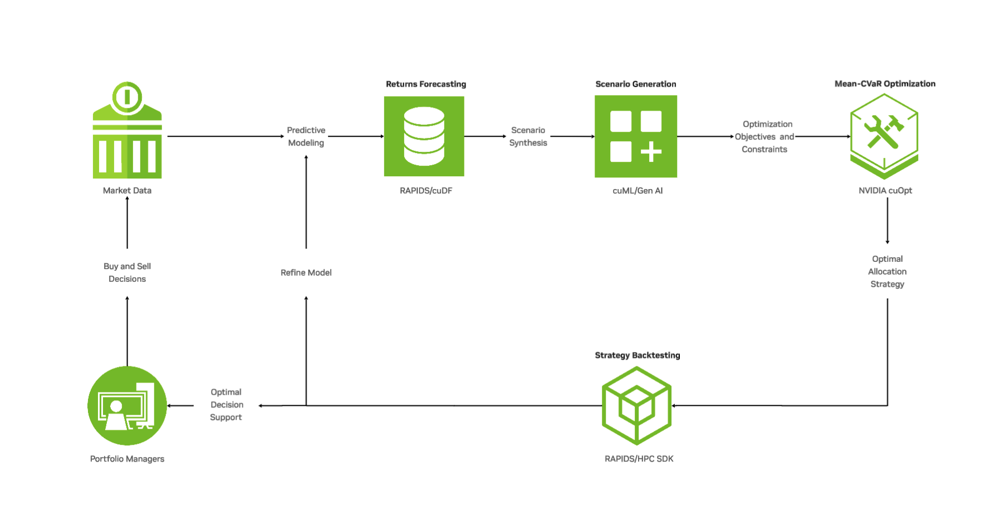

# Quantitative Portfolio Optimization developer example

## Disclaimer
This project will download and install additional third-party open source software projects. Review the license terms of these open source projects before use.

---

## Overview

This developer example addresses the financial industry's trade-off between **computational speed** and **model complexity** in portfolio optimization. By leveraging **NVIDIA accelerated computing**, this solution transforms robust analysis (e.g., Mean-CVaR, large-scale simulations) from slow batch processing into a **fast, iterative workflow** for dynamic decision-making.

### Accelerated Architecture

The end-to-end pipeline connects market data ingestion to optimal strategy backtesting using the NVIDIA CUDA ecosystem:

#### 1. Data Science & Scenario Generation
* **Technology:** **CUDA-X Data Science** (cuDF, cuML)
* **Function:** Accelerates data preprocessing and the learning/sampling of return distributions.
* **Performance:** Achieves speedups of up to **100x** when generating scenarios.

#### 2. Mean-CVaR Optimization
* **Technology:** **NVIDIA cuOpt** open-source solvers.
* **Function:** Efficiently solves complex, scenario-based **Mean-CVaR portfolio optimization** problems.
* **Performance:** Consistently outperforms state-of-the-art CPU-based solvers, with up to **160x speedups** in large-scale problems.

#### 3. Strategy Backtesting & Refinement
* **Technology:** **CUDA-X Data Science** and **HPC SDK**.
* **Function:** Rigorously tests the **trading strategies** and provides insights into strategy fine-tuning. 

### Key Takeaways

* **Speed-ups:** Up to **160x faster** optimization and **100x faster** scenario generation.
* **Risk Modeling:** Enables the use of **Conditional Value-at-Risk (CVaR)** at production speed.
* **Iterative Workflow:** Supports dynamic, fast, and data-driven optimization cycles.

<p align="center">
    
</p>

---
## Get Started
### System Requirements
<details>
<summary><b>Recommended Requirements for Best Performance</b></summary>

- **System Architecture**:
  - x86-64
  - ARM64
- **GPU**:
  - NVIDIA H100 SXM (compute capability >= 9.0) and above
- **CPU**:
  - 32+ cores
- **System Memory**:
  - 64+ GB RAM
- **NVMe SSD Storage**:
  - 100+ GB free space
- **CUDA**:
  - 13.0
- **NVIDIA Drivers**:
  - Latest NVIDIA drivers (580.65.06+)
- **OS**:
  - Linux distributions with glibc>=2.28 (released in August 2018):
    - Arch Linux (minimum version 2018-08-02)
    - Debian (minimum version 10.0)
    - Fedora (minimum version 29)
    - Linux Mint (minimum version 20)
    - Rocky Linux / Alma Linux / RHEL (minimum version 8)

The above configuration will provide optimal performance for large-scale optimization problems.

</details>

### Installation on PyTorch Container

To install dependencies on the NVIDIA PyTorch container:

```bash
# Start the container
docker run --gpus all -it --rm -v ./:/workspace/host --ipc=host -p 8888:8888 nvcr.io/nvidia/pytorch:25.10-py3

# Clone the repository
git clone https://github.com/NVIDIA-AI-Blueprints/quantitative-portfolio-optimization.git
cd quantitative-portfolio-optimization

# Install uv (if not already installed)
curl -LsSf https://astral.sh/uv/install.sh | sh

# To add $HOME/.local/bin to your PATH, either restart your shell or run:
source $HOME/.local/bin/env  # (sh, bash, zsh)
# source $HOME/.local/bin/env.fish  # (fish)

# Install with CUDA-specific dependencies
uv sync --extra cuda13 # this container image has cuda13

# Optional: Install development tools
uv sync --extra cuda13 --extra dev  

# Create a Jupyter kernel for this environment
uv run python -m ipykernel install --user --name=portfolio-opt --display-name "Portfolio Optimization"

# Launch Jupyter Lab
uv run jupyter lab --no-browser --NotebookApp.token=''
```

**Note:** If you use a different container image than the suggested one above, during uv sync, please use the `--extra cuda12` or `--extra cuda13` flag to install the GPU packages (cuOpt, cuML) matching your container's CUDA version. The `uv sync` command automatically creates a virtual environment and installs all dependencies from `uv.lock`.

**Tip:** To check your CUDA version, run `nvidia-smi` and look for "CUDA Version" in the output.

**Important Notes:**
- If you encounter "No space left on device" errors, set `UV_CACHE_DIR` to an alternate cache location: `export UV_CACHE_DIR=/path/to/cache/directory`
- The `cuda12` and `cuda13` extras are mutually exclusive - install only one based on your system's CUDA version

#### Using the Jupyter Kernel

After launching Jupyter Lab:
1. Navigate to the [`notebooks/`](notebooks/) directory
2. Open any notebook (e.g., `cvar_basic.ipynb`)
3. Select the "Portfolio Optimization" kernel from the kernel selector in the top-right corner
4. If the kernel is not visible, refresh the page or restart Jupyter Lab

To list all available kernels:
```bash
jupyter kernelspec list
```

To remove the kernel later (if needed):
```bash
jupyter kernelspec uninstall portfolio-opt
```

### Quick Start Locally

Explore the example notebooks in the [`notebooks/`](notebooks/) directory:
- **`cvar_basic.ipynb`**: Complete walkthrough of Mean-CVaR portfolio optimization with GPU acceleration
- **`efficient_frontier.ipynb`**: A quick tutorial on how to generate efficient frontier.
- **`rebalancing_strategies.ipynb`** Introduction to dynamic re-balancing and examples of testing strategies

### Deploy on Brev
Deploy using [Brev launchable](https://brev.nvidia.com/launchable/deploy?launchableID=env-360InRZzyHqDnJYQKIxaSggF8xI): start an instance on Brev.nvidia.com and follow the instructions in the notebooks. 


---
## Contribution Guidelines

We welcome contributions to this project! Please see [CONTRIBUTING.md](CONTRIBUTING.md) for detailed guidelines on:
- Code of conduct
- How to submit issues and feature requests
- Pull request process
- Coding standards and best practices

---
## Community

For questions, discussions, and community support:
- **Issues**: Report bugs and request features via [GitHub Issues](https://github.com/NVIDIA-AI-Blueprints/quantitative-portfolio-optimization/issues)
- **Discussions**: Join conversations in [GitHub Discussions](https://github.com/NVIDIA-AI-Blueprints/quantitative-portfolio-optimization/discussions)

---
## References

- [NVIDIA cuOpt Documentation](https://docs.nvidia.com/cuopt/)
- [RAPIDS cuML](https://docs.rapids.ai/api/cuml/stable/)
- Markowitz, H. (1952). "Portfolio Selection". *The Journal of Finance*, 7(1), 77-91.
- Rockafellar, R. T., & Uryasev, S. (2000). "Optimization of conditional value-at-risk". *Journal of Risk*, 2, 21-42.

---
## License

This project is licensed under the Apache License 2.0 - see the [LICENSE](LICENSE) file for details.
